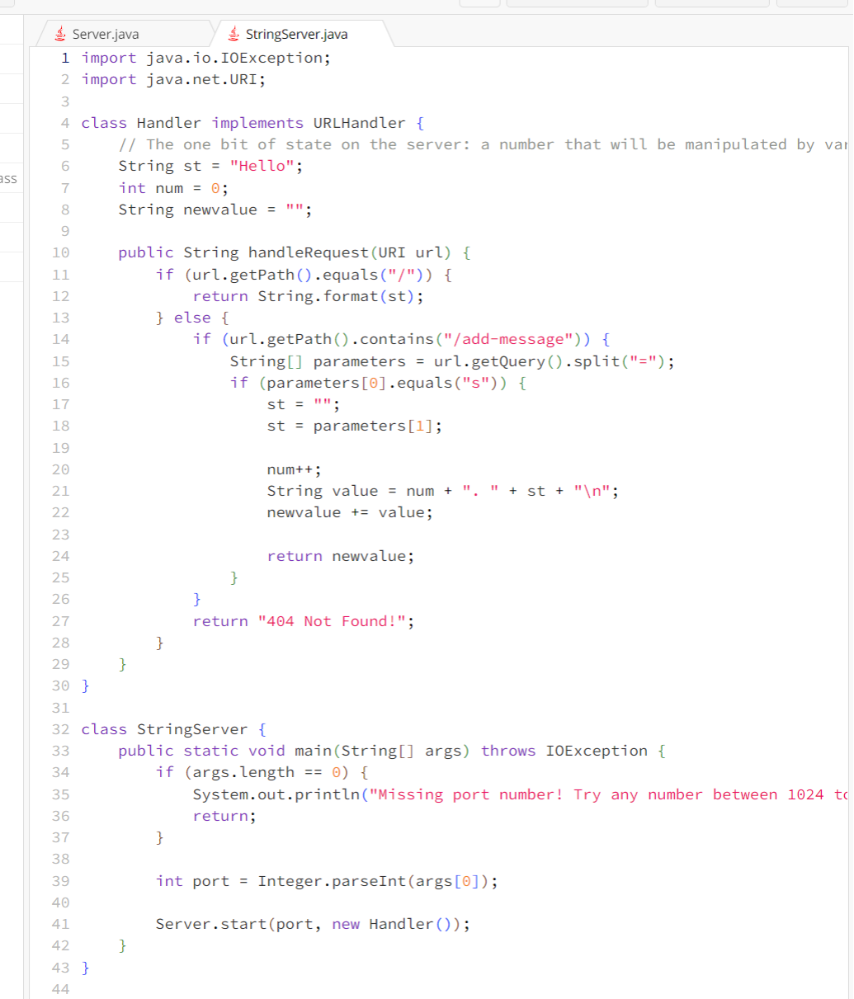
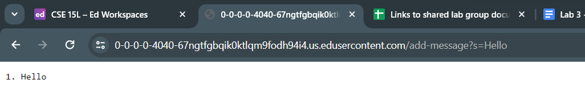
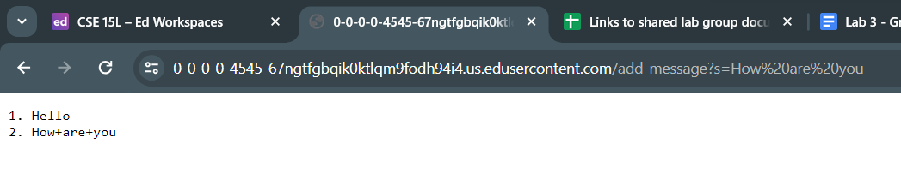
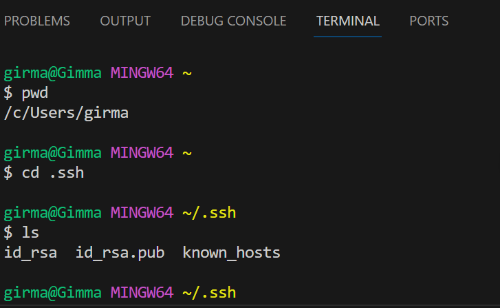
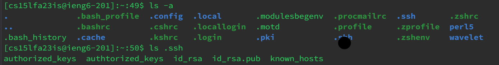
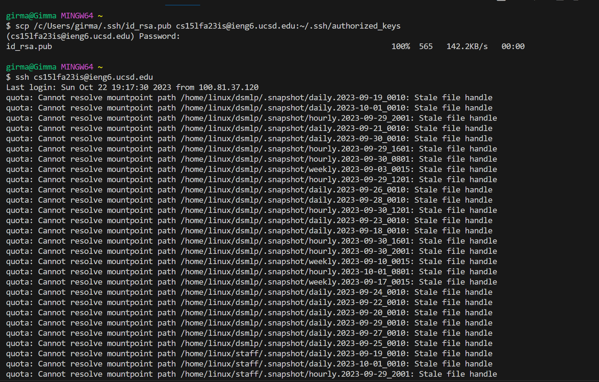
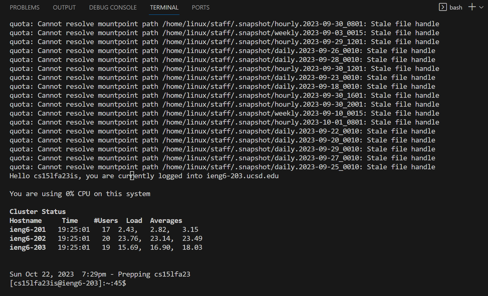

# Servers and SSH Keys (Week 3)
**Part_One**
## StringServer_code<br>
<br>
## ```/add-message?s=Hello```<br>
<br>
_Which methods in your code are called?_<br>
The relevant method called is ```handleRequest(URI url)``` in the Handler class.

_What are the relevant arguments to those methods, and the values of any relevant fields of the class?_<br>
The relevant field values in the Handler class before the request are:<br>

```st``` is "Hello"<br>
```num``` is 0<br>
```newvalue``` is an empty string.<br>

_How do the values of any relevant fields of the class change from this specific request?_<br>
The method checks if the path of the url is ```/```, it proceeds to the else block because its not the case here.
It checks if the path contains ```/add-message``` which is true now.
It splits the query string into parameters, ```parameters[0]``` is ```s``` and ```parameters[1]``` is ```Hello```.

```String st``` is changed to "Hello" because it's assigned the value from the URL parameter s=Hello.<br>
```int num``` is incremented by 1 because of the line ```num++;```. The current value of num is 1.<br>
```String newvalue``` is modified to include a new line that contains the updated message because of the lines:<br>
```String value = num + ". " + parameters[1] + "\n";```<br>
```newvalue += value;```<br>

## ```/add-message?s=How are you```<br>
<br>
_Which methods in your code are called?_<br>
The relevant method called is ```public String handleRequest(URI url)``` in the Handler class.

_What are the relevant arguments to those methods, and the values of any relevant fields of the class?_<br>
The relevant field values in the Handler class before this request are:<br>
```st``` is "Hello"<br>
```num``` is 1 (as it was incremented in the previous request)<br>
```newvalue``` is "1. Hello\n"<br>

_How do the values of any relevant fields of the class change from this specific request?_<br>
The method checks if the path of the url is ```/```, which is not the case in this request, so it proceeds to the else block. 
It checks if the path contains ```/add-message```.
It splits the query string into parameters, where parameters[0] is "s" and parameters[1] is "How are you."<br>

```st``` remains "Hello"<br>
```int num``` is incremented by 1 because of the line ```num++;```, now the value is stored as ```2```.<br>
```String newvalue``` is "1. Hello\n2. How are you\n"<br>

```String newvalue``` is modified to include a new line that contains the updated message because of this lines again:<br>
```String value = num + ". " + parameter[1] + "\n";```<br>
```newvalue += value;```<br>


**Part_Two**
The path to the private key for my SSH key for logging into ieng6 from my computer<br>
<br>
The path to the public key for my SSH key for logging into ieng6 from my account<br>
<br>
A terminal interaction where you log into ieng6 with your course-specific account without being asked for a password.<br>
<br>
<br>
**Part 3**
In a couple of sentences, describe something you learned from lab in week 2 or 3 that you didn’t know before.

1. The first thing I learned and am happy about is doing ```ssh``` to connect between different host servers and client laptop.
2. The other new and cool thing I learned is being able to connect to the servers from my laptops terminal through Visual Studio Code. 
