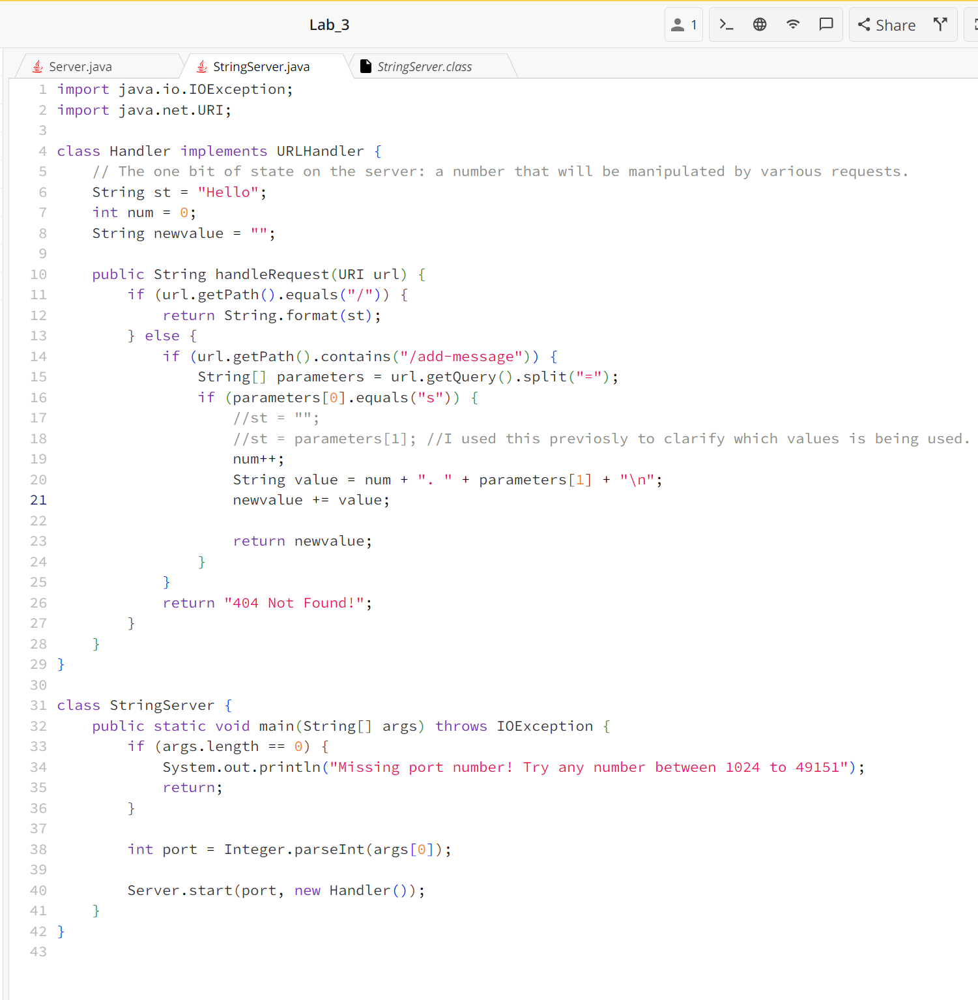
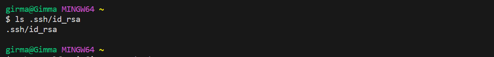

# Servers and SSH Keys (Week 3)
**Part_One**
## StringServer_code<br>
<br>
## ```/add-message?s=Hello```<br>
<br>
_Which methods in your code are called?_<br>
The relevant method called is ```handleRequest(URI url)``` in the Handler class.

_What are the relevant arguments to those methods, and the values of any relevant fields of the class?_<br>
The relevant arguments to this method is URI url with the value of ```/add-message?s=Hello``` after parsing, it is:<br>
```https://0-0-0-0-4040-67ngtfgbqik0ktlqm9fodh94i4.us.edusercontent.com/add-message?s=Hello```

_How do the values of any relevant fields of the class change from this specific request?_<br>

```String st``` is changed to "Hello" because it's assigned the value from the URL parameter s=Hello.<br>
```int num``` is incremented by 1 because of the line ```num++;```. The current value of num is 1.<br>
```String newvalue``` is modified to include a new line that contains the updated message because of the lines:<br>
```String value = num + ". " + st + "\n";```<br>
```newvalue += value;```<br>

## ```/add-message?s=How are you```<br>
<br>
_Which methods in your code are called?_<br>
The relevant method called is ```handleRequest(URI url)``` in the Handler class.

_What are the relevant arguments to those methods, and the values of any relevant fields of the class?_<br>
The relevant arguments to this method is URI url with the value of ```/add-message?s=How are you``` after parsing, it is:<br>
```[https://0-0-0-0-4040-67ngtfgbqik0ktlqm9fodh94i4.us.edusercontent.com/add-message?s=Hello](https://0-0-0-0-4545-67ngtfgbqikoktlqm9fodh9414.us.edusercontent.com/add-message?s=How%20are%20you)```

_How do the values of any relevant fields of the class change from this specific request?_<br>

```String st``` is changed to "How are you" because it's assigned the value from the URL parameter ```s=How are you```.<br>
```int num``` is incremented by 1 because of the line ```num++;```, now the value is stored as ```2```.<br>
```String newvalue``` is modified to include a new line that contains the updated message because of this lines again:<br>
```String value = num + ". " + st + "\n";```<br>
```newvalue += value;```<br>

**Part_Two**
The path to the private key for my SSH key for logging into ieng6 from my computer<br>
<br>
The path to the public key for my SSH key for logging into ieng6 from my account<br>
<br>
A terminal interaction where you log into ieng6 with your course-specific account without being asked for a password.<br>
<br>
<br>
**Part 3**
In a couple of sentences, describe something you learned from lab in week 2 or 3 that you didn’t know before.

1. The first thing I learned and am happy about is doing ```ssh``` to connect between different host servers and client laptop.
2. The other new and cool thing I learned is being able to connect to the servers from my laptops terminal through Virtual Studio Code. 
