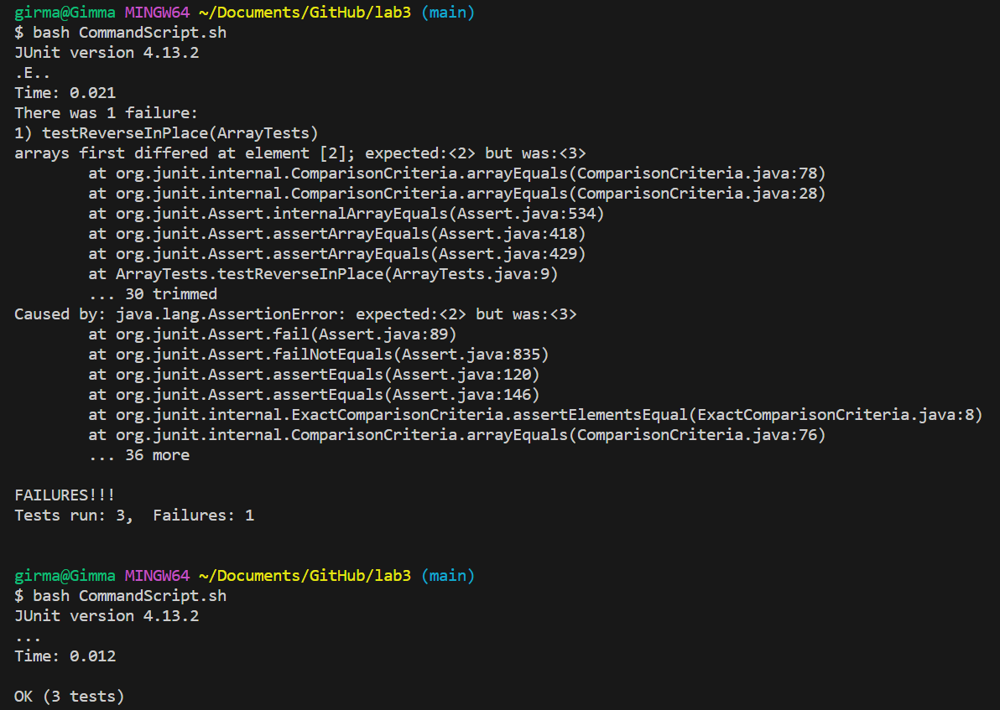

# Lab Report 3 - Bugs and Commands (Week 5)
**Part 1 - Bugs**
* A failure-inducing input for the buggy program, as a JUnit test and any associated code (write it as a code block in Markdown)
```
@Test 
	public void testReverseInPlace() {
    int[] input1 = { 1,2,3,4 };
    ArrayExamples.reverseInPlace(input1);
    assertArrayEquals(new int[]{ 4,3,2,1 }, input1);
	}
``` 
  
* An input that doesn’t induce a failure, as a JUnit test and any associated code (write it as a code block in Markdown)
```
@Test 
	public void testReverseInPlace() {
    int[] input1 = { 4 };
    ArrayExamples.reverseInPlace(input1);
    assertArrayEquals(new int[]{ 4 }, input1);
	}
``` 
  
* The symptom, as the output of running the tests (provide it as a screenshot of running JUnit with at least the two inputs above)
<br>
I tried to run a test for a buggy code with two diffirent inputs. The first one has four numbers and the test failed ```arrays first differed at element [2]; expected:<2> but was:<3>```; but with the second test I used an input that doesn't induce failure, one digit, and the test returned no failure eventhough we know it has bugs.<br>
  
* The bug, as the before-and-after code change required to fix it (as two code blocks in Markdown)
  # Before 
```
static void reverseInPlace(int[] arr) {
     for(int i = 0; i < arr.length; i += 1){
      arr[i] = arr[arr.length - i - 1];
    }
  }
```
This code trys to reverse an array in place, but iIt uses the same array to store both the original and reversed values, overwriting the original values before they can be properly reversed. If I use input {4,3,2,1}, the result will be {1,2,1,1}.<br>
# After fixed the bug
```
static void reverseInPlace(int[] arr) {
     for(int i = 0; i < arr.length/2; i += 1){
      int tempo = arr[i];//arr.length/2
      arr[i] = arr[arr.length - i - 1];
      arr[arr.length-i-1] = tempo;
    }
  }
```
In this one, it iterates through the first half of the array up to ```arr.length/2```. During each iteration, it swaps the element at index i with the element at the corresponding position from the end ```arr.length - i - 1```. The temporary variable ```temp``` is used to ensure that the original values are not overwritten before they are swapped. So this code reverses the array in correctly without losing data.
**Part 2 - Researching Commands**
# 4 interesting command-line options or alternate ways to use the command ```find```
1. ```-name``` This option is used to search for files and directories by name. It allows you to specify a name or use wildcards to match names.<br>
_example 1_
```
girma@Gimma MINGW64 ~/Documents/GitHub/docsearch (main)
$ find -name "chapter-1.txt"
./technical/911report/chapter-1.txt
```


2. ```-type``` this option is used to filter files or directories based on their type (e.g., regular files, directories, symlinks, named pipes, sockets).<br>
_example 1_
```
girma@Gimma MINGW64 ~/Documents/GitHub/docsearch/technical/911report (main)
$ find -type f
./chapter-1.txt
./chapter-10.txt
./chapter-11.txt
./chapter-12.txt
./chapter-13.1.txt
./chapter-13.2.txt
./chapter-13.3.txt
./chapter-13.4.txt
./chapter-13.5.txt
./chapter-2.txt
./chapter-3.txt
./chapter-5.txt
./chapter-6.txt
./chapter-7.txt
./chapter-8.txt
./chapter-9.txt
./preface.txt
```
This ```-type``` connected with find command help us to reduce our search scope by the type of the file; in this case it'll return only the files.


3. ```-size``` limits the search for files by size.<br>
_example 1_
```
girma@Gimma MINGW64 ~/Documents/GitHub/docsearch (main)
$ find -size +180k
./.git/objects/pack/pack-9155f305b04899d32718c159a69aedd038c25dbf.pack
./lib/junit-4.13.2.jar
./technical/911report/chapter-13.4.txt
./technical/911report/chapter-13.5.txt
./technical/911report/chapter-3.txt
./technical/government/About_LSC/commission_report.txt
./technical/government/Env_Prot_Agen/bill.txt
./technical/government/Env_Prot_Agen/multi102902.txt
./technical/government/Gen_Account_Office/d01591sp.txt
./technical/government/Gen_Account_Office/GovernmentAuditingStandards_yb2002ed.txt
./technical/government/Gen_Account_Office/pe1019.txt
./technical/government/Gen_Account_Office/Statements_Feb28-1997_volume.txt
```
This limits the size of the file we are looking for. It'll return the files in this terminal those has only less that the given size. 


4. ```-mtime``` is used to search for files based on their modification time, allowing you to find files modified within a specific time frame.<br>
_example 1_
```
girma@Gimma MINGW64 ~/Documents/GitHub/docsearch/technical/911report (main)
$ find -mtime -1
./chapter-1.txt
```
This command will locate files modified within the past 1 days in 911report directory

_source_:[https://www.redhat.com/sysadmin/linux-find-command]
