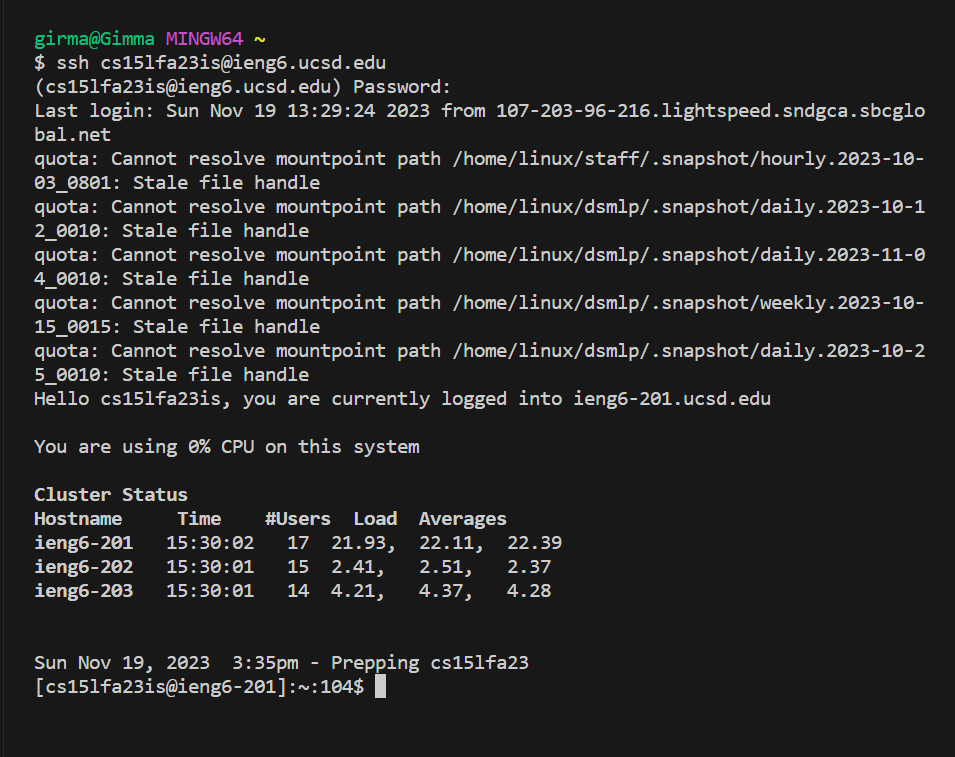
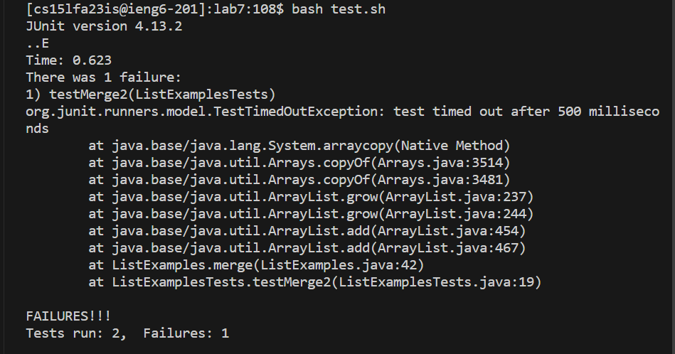
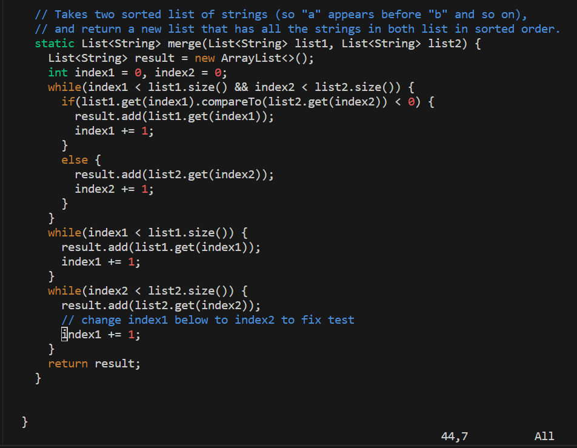
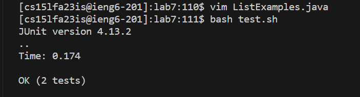
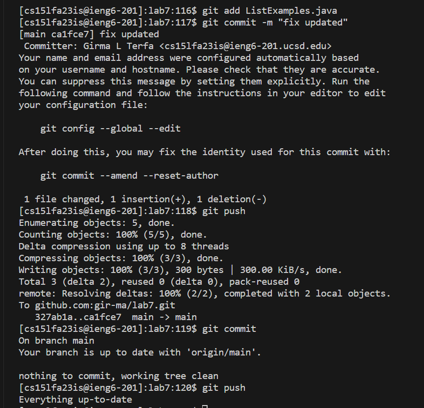

# Lab Report 4, Vim<br>
**4. Log into ieng6**<br>
To login to my account, first I started the VS code application on my laptop. Then I clicked the ```<ctr>``` + ```<`>``` to start the terminal then, I typed  ```ssh cs15lfa23is@ieng6.ucsd.edu``` and clicked ```<enter>``` . Even though I setted up my account to login without password in the previous lab, it prompted me to enter a password; so I typed in my password and hit ```<enter>``` . And I got this login page.<br>
<br>
**5. Clone your fork of the repository from your Github account (using the SSH URL)**<br>
To clone the repository from my github account, I typed ```git clone``` and pasted the ```SSH``` URL that I got from performing the steps provided ```git clone git@github.com:gir-ma/lab7.git``` . to paste what I copied on my clipboard I ```<right click>``` . (the shortcuts are not working on my VS code terminal) then I click ```<enter>```  to get the following message.<br>
<br>
**6. Run the tests, demonstrating that they fail**<br>
Now to change my working directory to the cloned file, I typed ```cd lab7``` and hit ```<enter>``` . After changing the working directory, I run the bash command by typing ```bash te <tab>, <enter>``` the ```<tab>``` key fills in the line with ```bash test.sh```. Then I got this result with some  failures.<br>

<br>
**7. Edit the code file ListExamples.java to fix the failing test**<br> 
To edit the file I typed ```vim ListExamples.java``` and then pressed ```<enter>``` . then it took me to the vim normal mode and my cursor was on the first letter of the line I wanted to make change so clicked ```n``` ```n``` ```n``` ```n``` ```n``` when the number 1 is select in the ```index2``` I pressed ```x``` and deleted the number then I pressed ```i``` to inter the editing mode and pressed ```2``` . Then I clicked ```<esc>``` to get back to normal mode then I typed ```:wq``` to save and quit; that took me back to terminal.<br>
<br>
**8. Run the tests, demonstrating that they now succeed**<br>
Now I run the bash command again to check the result. To do that I clicked the up arrow two times ```<up>``` ```<up>```because I’ve run it before. Then when it shows me the ```bash test.sh``` command I hit ```<enter>``` and got the following result.<br>

<br>
**9. Commit and push the resulting change to your Github account**<br>
For this last step I typed ```git add ListExamples.java``` and pressed ```<enter>```. Then,I typed ```git commit -m "fix updated"``` and pressed ```<enter>```. After that, I typed ```git push``` and pressed ```<enter>``` to stage a file we just edited to be part of the next commit. Then, I run ```git commit``` to create a commit locally for all added/staged files. After that, I ran ```git push``` to copy all new commits to the remote Github account.
<br>
