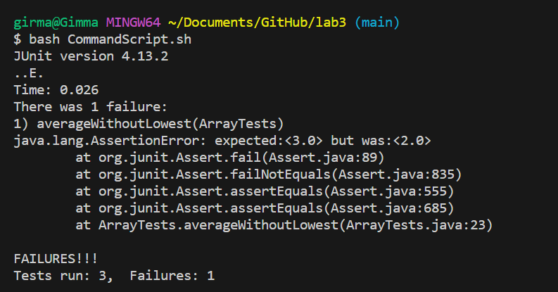
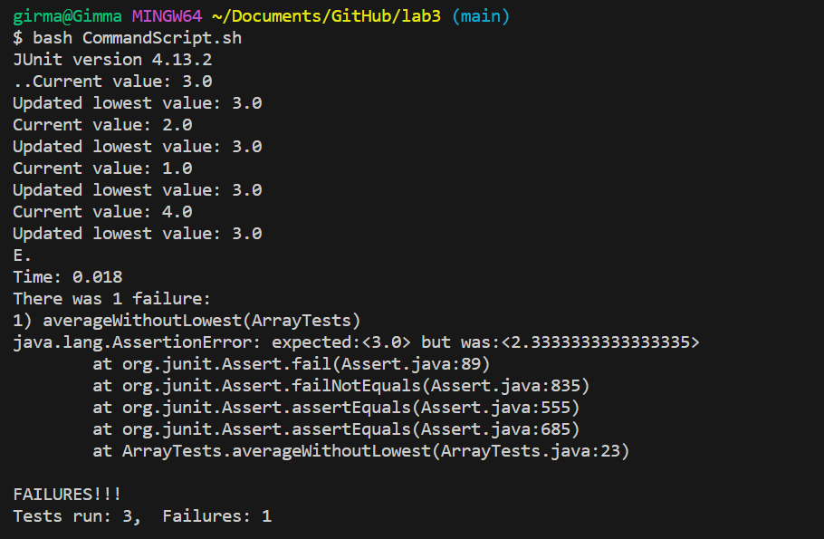
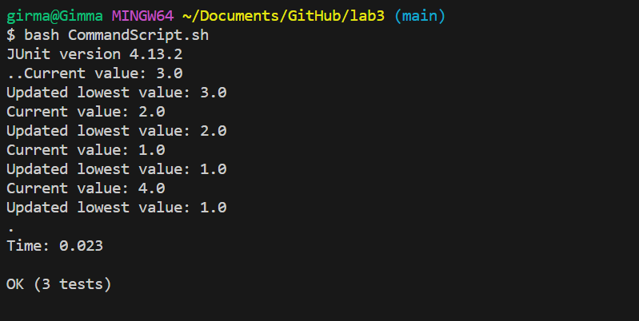

# Lab Report 5 - Putting it All Together (Week 9)
**Part 1 – Debugging Scenario**<br>
Design a debugging scenario, and write your report as a conversation on EdStem. It should have:<br>

<div class="message" style="background-color: #f0f0f0; padding: 10px; border-radius: 5px; margin: 10px 0;">
  <p><strong>Student:</strong> Hi there! For my Lab_report 3 I'm trying to do add a method to the ArrayExamples class, with this class I wanted to calculate average without the lowest value. But its not passing my test code. I've attached the error output I got from the test.</p>
</div>

 

<div class="message" style="background-color: #d3e5fc; padding: 10px; border-radius: 5px; margin: 10px 0; text-align: right;">
  <p><strong>TA:</strong> Hello! Have you tried printing out the values before and after the loop where the bug is located. Let me know wheather you have unother question and what you find from your output</p>
</div>
<div class="message" style="background-color: #f0f0f0; padding: 10px; border-radius: 5px; margin: 10px 0;">
  <p><strong>User A:</strong> Thank you for the guide, After trying the method you told me, now I can see the error is occuring on the comparison if statement. It's returning 3 as lowest value while the correct value should've been 1. The lowest values is not updating after each iteration.
Here is the screenshot of my output.</p>
</div>

<br>

_Information needed about the setup:_<br>
    + I used the code we used for lab 3 [https://github.com/gir-ma/lab3.git] this file contains ```ArrayTests.java```,  ```ArrayExamples.class```, ```ArrayExamples.java ```, ```ArrayTest.class ```, ```ArrayTest.java```, ```CommandScript.sh```.<br>
   
   + The snippet of the code with bug before fixing the bug is: <br>
  
```
    static double averageWithoutLowest(double[] arr) {
    if(arr.length < 2) { return 0.0; }
    double lowest = arr[0];
    for(double num: arr) {
      if(num == lowest) { lowest = num; }
    }
    double sum = 0;
    for(double num: arr) {
      if(num != lowest) { sum += num; }
    }
    return sum / (arr.length - 1);
  }
```
   + The full command line (or lines) you ran to trigger the bug<br>
I ran the bash command with 
```
set -e 
javac -cp ".;lib/hamcrest-core-1.3.jar;lib/junit-4.13.2.jar" *.java
java -cp ".;lib/junit-4.13.2.jar;lib/hamcrest-core-1.3.jar" org.junit.runner.JUnitCore ArrayTests
```
This also trigers the ```ArrayTest``` class which uses the method<br>
```
   
  @Test
  public void averageWithoutLowest() {
      double[] input2 = {3,2,1,4};
      double expectedValue = 3;
      double delta = 0.001; // Adjust the delta as needed for your precision requirements
      assertEquals(expectedValue, ArrayExamples.averageWithoutLowest(input2), delta);
  }
```
The exact loop in the ```ArrayExample``` class that couse this error is<br>
```
for(double num: arr) {
      if(num == lowest) { lowest = num; }
    }
```
  + A description of what to edit to fix the bug<br>
To fix the bug following the TA's response I updated the loop like the following,<br>
   
```
    for(double num: arr) {
      System.out.println("Current value: " + num);
      if(num == lowest) { lowest = num; }
      System.out.println("Updated lowest value: " + lowest);
    }
```
Then I fixed the line as follow and got the right output.<br>

```
  for(double num: arr) {
      System.out.println("Current value: " + num);
      if(num < lowest) { lowest = num; }
      System.out.println("Updated lowest value: " + lowest);
    }
```
Output after fixing the bug:<br>
<br> 
**Part 2 – Reflection**<br>
In the second half of this quarter, I delved into learning Vim, a powerful text editor with a steep but rewarding learning curve. I discovered various commands and functionalities that significantly improved my coding efficiency. Additionally, I explored the use of the Java Debugger (jdb) for debugging, particularly employing breakpoints to analyze and troubleshoot code execution. These skills not only enhanced my coding workflow but also provided valuable insights into effective debugging practices.
