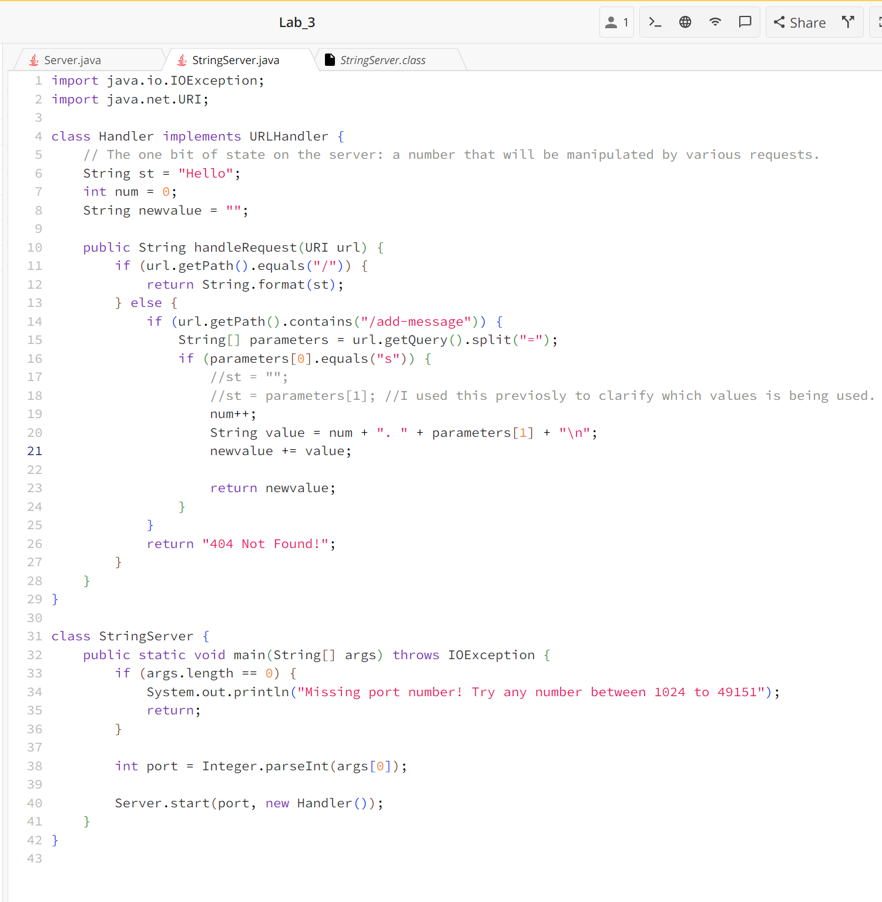
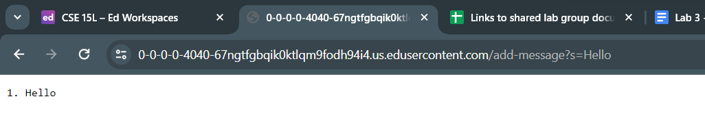
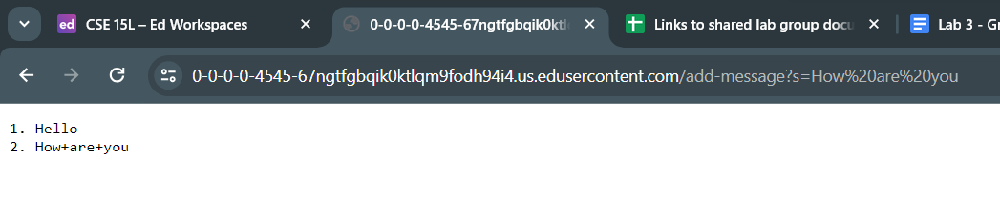

# Lab Report 2 - Servers and SSH Keys (Week 3)
** Part_One **
## StringServer_code<br>
<br>
## ```/add-message?s=Hello```<br>
<br>
Which methods in your code are called?<br>
What are the relevant arguments to those methods, and the values of any relevant fields of the class?<br>
How do the values of any relevant fields of the class change from this specific request? If no values got changed, explain why.<br>
## ```/add-message?s=How are you```<br>
<br>
Which methods in your code are called?<br>
What are the relevant arguments to those methods, and the values of any relevant fields of the class?<br>
How do the values of any relevant fields of the class change from this specific request? If no values got changed, explain why.<br>
** Part_Two **
The path to the private key for your SSH key for logging into ieng6<br>
<br>
The path to the public key for your SSH key for logging into ieng6<br>
<br>
A terminal interaction where you log into ieng6 with your course-specific account without being asked for a password.<br>
<br>
<br>
