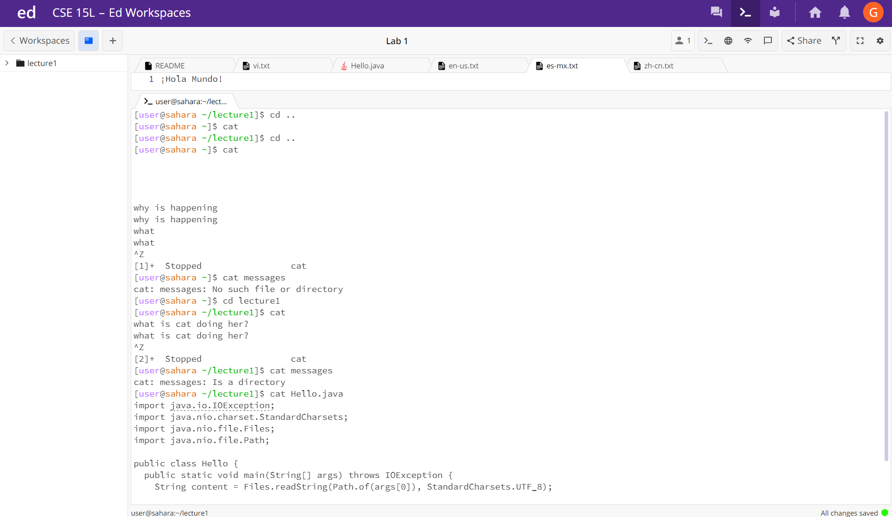

# **The basic filesystem commands** <br> 
Below are some examples of how to command file system that I learned in the first week of my class.<br>
```cd``` **Change Directory**
is used to change the current working directory in the terminal.<br> 

```ls``` **List**
is used to list the contents of the current directory.<br> 


```cat``` **Concatenate**
is used to display the contents of a file in the terminal.<br> 


